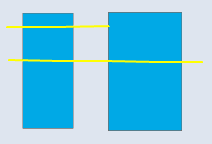
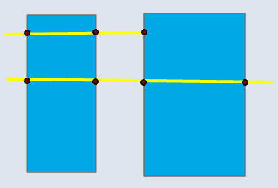
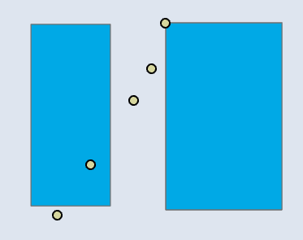
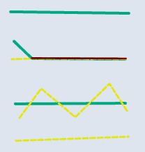

# 🛠️ Intersect

**Purpose:**  
*In Intersect, the output layer consists of only the features or parts of them that appear in both or all of the inputs. Features or portions of features that overlap in all layers will be written to the output.*

---

## 📋 Technical Specifications

| Requirement | Detail |
| :--- | :--- |
| **Input Feature Types** | Any |
| **Output Feature Type** | Same or lesser dimension |
| **Map Name** | 01.Intersect |
| **Inputs GDB** | `02.input_intersect.geodatabase` |
| **Output GDB** | `02.output_intersect.geodatabase` |

---

## 🧠 Logic & Arithmetic Operation

**Logic:** AND / Multiplication  

### Logic Flow

Overlay retains only the areas where all input features overlap.

---

## ⚙️ Parameters & Conditions

- **Input Parameter:** Input Features  
- **Overlay Parameter:** None  
- **Geometry:** Any  
- **No. of Inputs:** Two or more  
- **Order:** Doesn’t matter ($A \cap B = B \cap A$)  
- **Coordinate System:** Same as 1st input layer  

---

## 📐 Input Geometry Combinations and Output Rule

Overlay tools can accept inputs of any geometry type.  
The three basic vector geometries are:

- **Point**
- **Line**
- **Polygon**

### 🔗 Possible Input Pairs

With repetition allowed, there are nine input pairs:

1. (Point, Point)  
2. (Point, Line)  
3. (Point, Polygon)  
4. (Line, Point)  
5. (Line, Line)  
6. (Line, Polygon)  
7. (Polygon, Point)  
8. (Polygon, Line)  
9. (Polygon, Polygon)  

Since overlay is commutative (*A ∩ B = B ∩ A*), pairs (2, 3, 6) are equivalent to (4, 7, 8).  
Thus, there are effectively **six unique input combinations**.

---

### ⚙️ Output Type Rule

The tool provides an optional parameter **Output Type** with values:

- *Same as Input* (default)  
- *Line*  
- *Point*  

The output geometry can only be the **same as the lowest‑dimension input** or **lower**:

- **Polygon input present** → Output can be Polygon, Line, or Point  
- **Line input present** → Output can be Line or Point  
- **Point input only** → Output can only be Point  

---

### 📊 Input–Output Matrix (Intersect Tool)

| Input A \ Input B | Point Output | Line Output | Polygon Output |
|-------------------|:------------:|:-----------:|:--------------:|
| **Point**         | ✅           | ❌          | ❌             |
| **Line**          | ✅           | ✅          | ❌             |
| **Polygon**       | ✅           | ✅          | ✅             |

---

👉 In short: there are nine theoretical input pairs, reduced to six unique combinations by commutativity. The output geometry is constrained by the lowest dimension present among the inputs.

---

## 🐍 Arcpy Function

```python
arcpy.analysis.Intersect(in_features, out_feature_class, {join_attributes}, {cluster_tolerance}, {output_type})
```

for more on function parameters, [check: Arcpy Documentation Here.](https://pro.arcgis.com/en/pro-app/latest/tool-reference/analysis/intersect.htm#GUID-5733B868-D7A2-4E44-A3CA-6B5360CAF0F8)

## Figures

### 📊 Polygon–Polygon

| Input | Point Output | Line Output | Polygon Output |
| :---: | :---: | :---: | :---: |
|  |  |  |  |

---

### 📊 Polygon–Line

| Input | Point Output | Line Output |
| :---: | :---: | :---: |
|  |  |  |

---

### 📊 Polygon–Point

| Input | Point Output |
| :---: | :---: |
|  |  |

---

### 📊 Line–Line

| Input | Point Output | Line Output |
| :---: | :---: | :---: |
|  |  |  |

---

### 📊 Line–Point

| Input | Point Output |
| :---: | :---: |
|  |  |

---

### 📊 Point–Point

| Input | Point Output |
| :---: | :---: |
|  |  |
