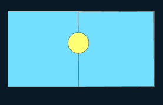
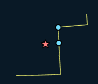

# 🛠️ Erase

**Purpose:** > *In Erase, the output layer consists of only those portions of the input features falling
outside the erase features. Geometries that are coincident between the Input Features
and Erase Feature parameter values will be removed.*

---

## 📋 Technical Specifications

| Requirement | Detail |
| :--- | :--- |
| **Input Feature Types** | Any |
| **Output Feature Type** | Same or lesser dimension |
| **Map Name** | 03.erase |
| **inputs GDB** | `03.input_erase.geodatabase` |
| **output GDB** | `03.output_erase.geodatabase` |

---

## 🧠 Logic & Arithmetic Operation

**Logic:** AND NOT / Subtract

## ⚙️ Parameters & Conditions

**Input Parameter:** Input Features

**Geometry:** Any

**No. of Inputs:** One or more

**Order:** matters $A - B = B - A$

**Coordinate System:** Same as 1st input layer

## Input and Erase Combinations

The **Erase Features** parameter defines the extent of erasure.  
It can have any geometry type as long as it is the **same or of greater dimension** than the input layer.  

- ❌ A point erase feature cannot be used on a polygon input.  
- ✅ The output layer always has the **same geometry type as the input**.

---

### 📐 Geometry Hierarchy

- **Polygon (2D)** > **Line (1D)** > **Point (0D)**

---

### 🔗 Valid Input–Erase Combinations

Format: *(Input, Erase)*

1. (Point, Point)  
2. (Point, Line)  
3. (Line, Line)  
4. (Point, Polygon)  
5. (Line, Polygon)  
6. (Polygon, Polygon)  

---

### 🚩 Important Notes

- Unlike **Union** or **Intersect**, erasure is **not commutative**:  
  
$$
  A - B \neq B - A
$$

- For combinations with **different geometries** (2, 4, 5), output is **not possible**.  
- For combinations with the **same geometry type**, results differ depending on which layer is input vs. erase.  
- This gives us **nine possible scenarios** to consider when starting experiments.

---

### 📊 Summary Table

| Input Geometry | Allowed Erase Geometry | Output Geometry |
|----------------|------------------------|-----------------|
| Point          | Point, Line, Polygon   | Point           |
| Line           | Line, Polygon          | Line            |
| Polygon        | Polygon                | Polygon         |


## 🐍 Arcpy Function

```python
arcpy.analysis.Erase(in_features, erase_features, out_feature_class, {cluster_tolerance})
```

for more on function parameters, [check: Arcpy Documentation Here.](https://pro.arcgis.com/en/pro-app/latest/tool-reference/analysis/erase.htm#GUID-9A2461E4-6E51-4012-AF3A-F9D00DDE405A)

## Figures

### 📊 Same Input \& Output

| Feature Type | Input | Output |
| :---: | :---: | :---: |
| Point |  |  |
| Line |  |  |
| Polygon |  |  |

### Order matters for line

|  | $\neq$ |  |
| :---: | :---: | :---: |

---

### Different Inputs

| Feature - Erase | Input | Output |
| :---: | :---: | :---: |
| Point - Line |  |  |
| Point - Polygon |  |  |