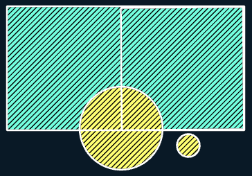

# 🛠️ Intersect

**Purpose:** > *The output of Identity has the extent and all the features of input layer,
with the geometry and attributes merged in the area where input and
identity layer overlaps. At the places of overlaps, Input layer features will get
the attributes of Identity layer.*

---

## 📋 Technical Specifications

| Requirement | Detail |
| :--- | :--- |
| **Input Feature Types** | Any |
| **Output Feature Type** | Same or lesser dimension |
| **Map Name** | 01.Intersect |
| **inputs GDB** | `01.input_intersect.geodatabase` |
| **output GDB** | `01.output_intersect.geodatabase` |

---

## 🧠 Logic & Arithmetic Operation

**Logic:** $(A - B ) \cup (A \cap B)$

### Logic Flow

## ⚙️ Parameters & Conditions

**Input Parameter:** Input Features

**Overlay Parameter:** identity Features

**Geometry:** Any

**No. of Inputs:** Two or more

**Order:** Doesn't matter $A \cap B = B \cap A$

**Coordinate System:** Same as 1st input layer

## 🐍 Arcpy Function

```python
arcpy.analysis.Identity(in_features, identity_features, out_feature_class, {join_attributes}, {cluster_tolerance}, {relationship})
```

for more on function parameters, [check: Arcpy Documentation Here.](https://pro.arcgis.com/en/pro-app/latest/tool-reference/analysis/identity.htm#GUID-28B42F37-ADD9-4931-B236-BF840AB9F1EE)

## Figures

| Input A | Input B | Result |
| :---: | :---: | :---: |
|  |  |  |
