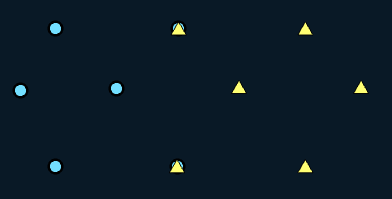
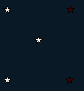
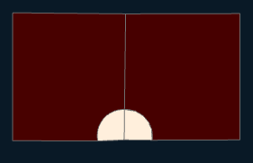

# 🛠️ Intersect

**Purpose:** > *The output of Identity has the extent and all the features of input layer,
with the geometry and attributes merged in the area where input and
identity layer overlaps. At the places of overlaps, Input layer features will get
the attributes of Identity layer.*

---

## 📋 Technical Specifications

| Requirement | Detail |
| :--- | :--- |
| **Input Feature Types** | Any |
| **Output Feature Type** | Same or lesser dimension |
| **Map Name** | 04.Intersect |
| **inputs GDB** | `04.input_intersect.geodatabase` |
| **output GDB** | `04.output_intersect.geodatabase` |

---

## 🧠 Logic & Arithmetic Operation

**Logic:** $(A - B ) \cup (A \cap B)$

## ⚙️ Parameters & Conditions

**Input Parameter:** Input Features

**Overlay Parameter:** identity Features

**Geometry:** Any

**No. of Inputs:** Two or more

**Order:** Doesn't matter $A \cap B = B \cap A$

**Coordinate System:** Same as 1st input layer

## ⚙️ Identity Tool: Parameters and Combinations

### 🔧 Parameters

- **Input Features**  
  - Geometry: Can be **Point**, **Line**, or **Polygon**  
  - Input and Identity layers can be the same or different  

- **Identity Features**  
  - Must be either **Polygon geometry** or the **same geometry type as the input**  
  - Defines the identity layer for overlay  
  - Output layer always has the **same geometry type as the input**

---

### 🔗 Input and Identity Combinations

Valid combinations (Format: *Input, Identity*):

1. (Point, Point)  
2. (Line, Line)  
3. (Polygon, Polygon)  
4. (Point, Polygon)  
5. (Line, Polygon)  

---

### 🚩 Important Notes

- Unlike **Union** or **Intersect**, Identity is **not commutative**:  
  
$$
  A \; \text{Identity} \; B \neq B \; \text{Identity} \; A
$$

- For combinations with **different geometries** (4 and 5), output is **not possible**.  
- For combinations with the **same geometry type**, results differ depending on the **extent of the layers**.  
- This gives us **eight possible scenarios** to consider when starting experiments.  

---

## 🐍 Arcpy Function

```python
arcpy.analysis.Identity(in_features, identity_features, out_feature_class, {join_attributes}, {cluster_tolerance}, {relationship})
```

for more on function parameters, [check: Arcpy Documentation Here.](https://pro.arcgis.com/en/pro-app/latest/tool-reference/analysis/identity.htm#GUID-28B42F37-ADD9-4931-B236-BF840AB9F1EE)

## Figures

### Same Input with different Order

#### Point

| Inputs | Output AB | Output BA |
| :---: | :---: | :---: |
|  |  |  |

#### Line

| Inputs | Output AB | Output BA |
| :---: | :---: | :---: |
|  |  |  |

#### Polygon

| Inputs | Output AB | Output BA |
| :---: | :---: | :---: |
|  |  |  |

### different Inputs

| Input-Identity | Input | Output  |
| :---: | :---: | :---: |
| Point-Polygon |  |  |
| Line-Polygon |  |  |

### 🎨 Symbology Note

Output features may vary in **colour and appearance** depending on the attribute symbology used in the Identity tool. This highlights changes in features and attributes of the input layer.
