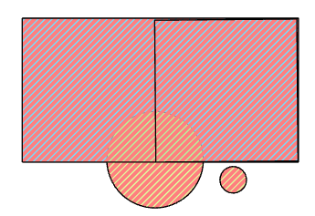

# 🛠️ Update

**Purpose:** > *Update is similar to Union in extent but in the area where the two layers
overlap, only the geometry and attributes of update layer is retained.*

---

## 🎭 Illustration


---

## 📋 Technical Specifications

| Requirement | Detail |
| :--- | :--- |
| **Input Feature Types** | {Polygon} |
| **Output Feature Type** | Polygon |
| **Map Name** | 05.Update |
| **inputs GDB** | `05.input_update.geodatabase` |
| **output GDB** | `05.output_update.geodatabase` |

---

## 🧠 Logic & Arithmetic Operation

**Logic:** $A \cap (B-A)$

## ⚙️ Parameters & Conditions

**Input Parameter:** Input Features

**Overlay Parameter:** Update Features

**Geometry:** Polygon

**No. of Inputs:** Two or more

**Order:** matters

**Coordinate System:** Same as 1st input layer

### 🚩 Key Notes

- The Update tool works similarly to **Union**, but with stricter rules:  
  - Both input and update layers must be polygons.  
  - The output is polygon in nature.  
- Unlike Union, **interchanging input and update layers produces different results**:  
  
$$
  A \; \text{Update} \; B \neq B \; \text{Update} \; A
$$

- This gives **two possible combinations** to start with, depending on which layer is chosen as input vs. update.

## 🐍 Arcpy Function

```python
arcpy.analysis.Update(in_features, update_features, out_feature_class, {keep_borders}, {cluster_tolerance})
```

for more on function parameters, [check: Arcpy Documentation Here.](https://pro.arcgis.com/en/pro-app/latest/tool-reference/analysis/update.htm#GUID-BA33E3AA-B8D6-49EA-9A68-200A748EEA29)

## 🖼️ Figures

| Inputs | Output AB | Output BA |
| :---: | :---: | :---: |
|  |  |  |
