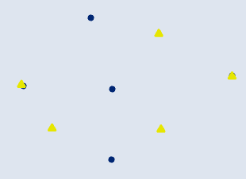
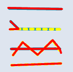

# 🛠️ Symmetrical Difference

**Purpose:** > *Symmetrical Difference is opposite to Intersect with
results having features or portions of features in the input and update
features that do not overlap written to it. In simple, which includes
features that occur in one of the layers but not both*

---

## 📋 Technical Specifications

| Requirement | Detail |
| :--- | :--- |
| **Input Feature Types** | Any |
| **Output Feature Type** | Same |
| **Map Name** | 06.Symmetrical Difference |
| **inputs GDB** | `06.input_sym_diff.geodatabase` |
| **output GDB** | `06.output_sym_diff.geodatabase` |

---

## 🧠 Logic & Arithmetic Operation

**Logic:** XOR , $(A \cup B) - (A\cap B)$ or $(A-B) \cup (B-A)$

### Logic Flow

## ⚙️ Parameters & Conditions

**Input Parameter:** Input Features

**Overlay Parameter:** Update Feature

**Geometry:** Any / Same

**No. of Inputs:** Two or more

**Order:** Doesn't matter

**Coordinate System:** Same as 1st input layer

## 🐍 Arcpy Function

```python
arcpy.analysis.SymDiff(in_features, update_features, out_feature_class, {join_attributes}, {cluster_tolerance})
```

for more on function parameters, [check: Arcpy Documentation Here.](https://pro.arcgis.com/en/pro-app/latest/tool-reference/analysis/symmetrical-difference.htm#GUID-C0BB5020-D689-49C5-B8F2-7AFFCBA971E4)

## Figures

| Geometry | Input| Result |
| :---: | :---: | :---: |
| Point |  |  |
| Line |  |  |
| Polygon |  |  |
