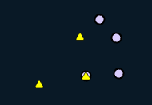
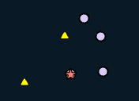
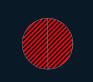

# 🛠️ Clip

**Purpose:** > *Clip extracts input features that overlay the clip features. The output contains
the same overall extent as the intersection, but only retains the geometry
and attributes of one of the input layers. It is most commonly used to trim
one layer by a polygon represent an area of interest.*

---

## 🎭 Illustration


---

## 📋 Technical Specifications

| Requirement | Detail |
| :--- | :--- |
| **Input Feature Types** | Any |
| **Output Feature Type** | Same |
| **Map Name** | 07.Clip |
| **inputs GDB** | `07.input_clip.geodatabase` |
| **output GDB** | `07.output_clip.geodatabase` |

---

## 🧠 Logic & Arithmetic Operation

**Logic:** $A - (A-B)$

## ⚙️ Parameters & Conditions

**Input Parameter:** Input Features

**Overlay Parameter:** Clip Features

**Geometry:** Any but same

**No. of Inputs:** Two or more

**Order:** matter

**Coordinate System:** Same as 1st input layer

## ⚙️ Clip Tool: Input and Clip Combinations

### 🔧 Parameters

- **Input Features**: Can be Point, Line, or Polygon  
- **Clip Features**: Must be the **same geometry type** or of **greater dimension** than the input  
- **Output Geometry**: Same as the input  

---

### 📐 Geometry Hierarchy

- **Polygon (2D)** > **Line (1D)** > **Point (0D)**

---

### 🔗 Valid Input–Clip Combinations

Format: *(Input, Clip)*

1. (Point, Point)  
2. (Point, Line)  
3. (Line, Line)  
4. (Point, Polygon)  
5. (Line, Polygon)  
6. (Polygon, Polygon)  

---

### 🚩 Important Notes

- Unlike **Union** or **Intersect**, Clip is **not commutative**:  
  
$$
  A \; \text{Clip} \; B \neq B \; \text{Clip} \; A
$$

- For combinations with **different geometries** (2, 4, 5), output is **not possible**.  
- For combinations with the **same geometry type**, results differ depending on the **extent of the clip layer**.  
- If **Point** or **Line** are used as clip features, only coincident features are included in the output (since they cannot define an area extent).  
- Overall, this gives **nine possible scenarios** to consider when starting experiments.

## 🐍 Arcpy Function

```python
arcpy.analysis.CountOverlappingFeatures(in_features, out_feature_class, {min_overlap_count}, {out_overlap_table})
```

for more on function parameters, [check: Arcpy Documentation Here.](https://pro.arcgis.com/en/pro-app/latest/tool-reference/analysis/count-overlapping-features.htm#GUID-AAE3386E-8636-4029-9611-44508AB41AC2)

## Figures

### 🟢 Point–Point Clip

| Input | Output |
| :---: | :---: |
|  |  |

---

### 🟢 Line–Line Clip

| Input | Output |
| :---: | :---: |
|  |  |

---

### 🟢 Polygon–Polygon Clip

| Input | Output (Yellow) | Output (Blue) |
| :---: | :---: | :---: |
|  |  |  |

---

### 🟢 Point–Line Clip

| Input | Output |
| :---: | :---: |
|  |  |

---

### 🟢 Point–Polygon Clip

| Input | Output |
| :---: | :---: |
|  |  |
