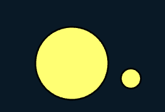

# 🛠️ Count Overlapping Features

**Purpose:** > *In ArcGIS Pro's Overlay toolset, there is a tool which counts the overlapping features in given layers and add there count in attributes accordingly. This tool computes both the overlapping features within a layers and between layers. The count of first is stored in the field **Count_** and later in **Count_FC**.*

---

## 🎭 Illustration


---

## 📋 Technical Specifications

| Requirement | Detail |
| :--- | :--- |
| **Input Feature Types** | Polygon |
| **Output Feature Type** | Same |
| **Map Name** | 08.Intersect |
| **inputs GDB** | `08.input_intersect.geodatabase` |
| **output GDB** | `08.output_intersect.geodatabase` |

---

## ⚙️ Parameters & Conditions

**Input Parameter:** Input Features

**Geometry:** Polygon

**No. of Inputs:** One or more

**Order:** Doesn't matter

**Coordinate System:** Same as 1st input layer

## 🐍 Arcpy Function

```python
arcpy.analysis.CountOverlappingFeatures(in_features, out_feature_class, {min_overlap_count}, {out_overlap_table})
```

for more on function parameters, [check: Arcpy Documentation Here.](https://pro.arcgis.com/en/pro-app/latest/tool-reference/analysis/count-overlapping-features.htm)

## Figures

| Input A | Input B | Result |
| :---: | :---: | :---: |
|  |  |  |

### Figure Summary

| Description | Detail |
|-------------|--------|
| **Colour Coding** | White = one feature (no overlap); Blue = two features (overlapping between Input A and Input B) |
| **Total Features** | 1 + 1 + 1 + 1 + 2 + 2 = **8** |
